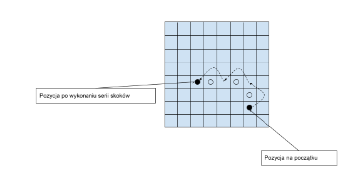

# Jumper
**OPIS**

Gra dla dwóch osób. Celem gry jest przestawienie wszystkich swoich pionków na pozycje
zajmowane na początku przez przeciwnika, czyli przeciwległe, skrajne dwie linie pól. Gracz, który
pierwszy tego dokona − wygrywa. Nie ma możliwości gry remisowej.

**Działanie gry:**

 **Ruch polega na:**
  - przesunięciu swojego pionka na dowolne sąsiednie pole wolne poziomo lub pionowo,
  - przeskoczeniu przez pionek własny lub przeciwnika z pola bezpośrednio
  sąsiadującego z przeskakiwanym pionkiem na pole bezpośrednio za nim(można
  przeskoczyć 1 pole),
  - wykonaniu całej serii skoków, na przykład:

**Dodatkowo:**
  - zmiana kierunku skoków jest możliwa,
  - pole gry to szachownica (plansza/mapa 8x8),
  - pionki nie biją się wzajemnie.

**Wykonanie ruchu:**
  - wybierz pionka klikając na niego, pole wybranego pionka zmienia kolor,
  - po wybraniu pionka wskaż, kolejno klikając na pola, na jakie pola ma skakać, jeśli któryś
  ze skoków nie będzie zgodny z zasadami gry, wyświetla się komunikat o niepoprawnym
  ruchu.
  - naciśnij przycisk startujący, aby wykonać wybrane ruchy.
  - liczba punktów: 3

**Warto również odróżnić kolorem lub kształtem pionki obu graczy oraz wyświetlać, którego
gracza jest aktualnie kolej.**
